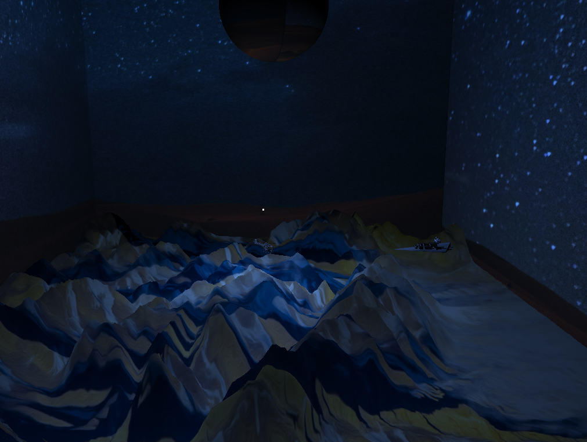

# Rapport TP CECILLON Enzo 11805901

## 1. Manipulation des Formes de Bases.

### 🧊  Cube

---

- **Code**
    
    En-tête de la procédure dans le .h
    
    
    
    Corps Procédure Affichage :
    
    
    
- **Affichage**
    
    
    

Corps de la procédure dans le .cpp

### 🥫 Cylindre

---

- **Code**
    
    En-tête de la procédure dans le .h
    
    
    
    Corps Procédure Affichage :
    
    
    
- **Affichage**
    
    
    

Corps de la procédure dans le .cpp

### Cône

---

- **Code**
    
    En-tête de la procédure dans le .h
    
    
    
    Corps Procédure Affichage :
    
    
    
- **Affichage**
    
    
    

Corps de la procédure dans le .cpp

### ⭕ Sphere

---

- **Code**
    
    En-tête de la procédure dans le .h
    
    
    
    Corps Procédure Affichage :
    
    
    
- **Affichage**
    
    
    

Corps de la procédure dans le .cpp

## 2. Affichage à l'aide de Transformation géométriques

---

### Destroyeur Star Wars

---

- **Code**
    
    En-tête de la procédure dans le .h
    
    
    
    Corps Procédure Affichage :
    
    Affichage de la base du vaisseau (la forme qui fait comme un escalier)
    
    
    
    
    
    Procédure qui affiche la tour, radio, et le contour du rectangle de la tour.
    
    
    
    Procédure qui affiche les mesh que l'on a définit dans les init_triangles pour la forme du vaisseau et une grosse procédure qui appel tous les draws pour que cela soit moins chargé dans render()
    
    
    
- **Affichage**
    
    
    

Corps de la procédure dans le .cpp

<aside>
⚠️ **J'ai utilisé le code de l'extrusion pour le reste du vaisseau (base)**

</aside>

---

## 3. Terrain, texture, billboard (arbre) et Cubemap

---

### Terrain

---

- **Code**
    
    En-tête de la procédure dans le .h
    
    
    
    Corps Procédure Affichage :
    
    
    
- **Affichage**
    
    
    

Corps de la procédure dans le .cpp

### Arbre | Billboard

---

- Code
    
    En tête de la procédure dans le .h
    
    
    
    Corps Procédure Affichage :
    
    
    
- Affichage
    
    
    

Corps de la procédure dans le .cpp

<aside>
📌 **Je n'ai pas compris comment définir la position d'un arbre en fonction de la hauteur du terrain donc je n'ai pas mis de boucle for avec une position aléatoire.**

</aside>

### Cubemap

---

- Code
    
    En tête de la procédure dans le .h
    
    
    
    Corps Procédure Affichage :
    
    
    
- Affichage
    
    
    
    
    

Corps de la procédure dans le .cpp

## 4. Modélisation d'un objet par extrusion 3D

---

- **Code**
    
    En-tête de la procédure dans le .h
    
    
    
    Corps Procédure Affichage :
    
    <aside>
    ⚠️ **J'utilise ce code pour l'extrusion de mes objets pour mon vaisseau donc ce n'est pas vraiment une procédure indépendante.**
    
    </aside>
    
    
    
    
    
- **Affichage**
    
    Exemple avec l'extrusion du triangle
    
    
    
    <aside>
    ⚠️ **On a déclaré une fonction init pour avoir les faces avant et arrière de notre triangle extrudé (On doit faire cette fonction pour chaque forme que l'on veut extrudé.)**
    
    </aside>
    
    
    

Corps de la procédure dans le .cpp

## 5. Texture animée

---

- Code
    
    En tête de la procédure dans le .h
    
    
    
    Corps Procédure Affichage :
    
    <aside>
    📌 **Très mal optimisé mais je n'ai pas eu le temps de re réfléchir cette étape du draw.**
    
    </aside>
    
    
    
- Affichage
    
    
    

Corps de la procédure dans le .cpp

## 6. Animation

---

- Code
    
    En tête de la procédure dans le .h
    
    
    
    Corps Procédure Affichage :
    
    
    

Corps de la procédure dans le .cpp

- Affichage
    
    
    

